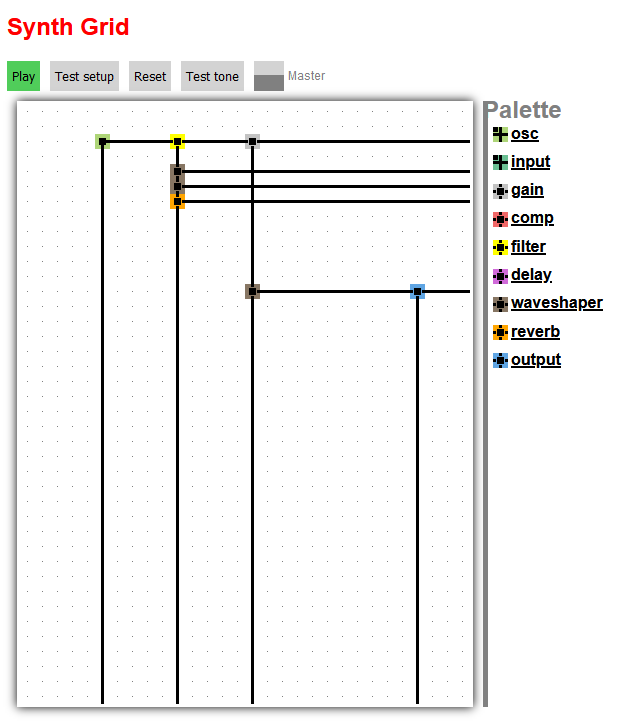

Very experimental Web Audio application allowing users to put processing blocks on a grid which are connected by predefined rules.

Currently there are three types of blocks:

-	Sources
	-	**osc**: An oscillator playing (as of now) random notes each time "Play" is pressed
	-	**input**: Feeds microphone input into the chain while "Play" is pressed
-	Effects
	-	**gain**: Attenuates the incoming signals by up to 30dB
	-	**comp**: Simple dynamics compressor
	-	**filter**: High-/Low-/Bandpass filter with adjustable frequency
	-	**delay**: Very simple delay unit delaying incoming signals by 0-2s
	-	**waveshaper**: Distortion unit
	-	**reverb**: Adds one of several types of reverb to the signal, controlled by a dry/wet control.
-	Sinks
	-	**output**: Applies some gain to the signal and sums it up with all other output nodes for playback.

Each block sends its output to the right and down. When a connection hits another connection, both are summed and sent further right and down. When one or two connections hit a block, they are summed and then either fed into the *Effect* unit, or summed with the output of the *Source* unit. All connections arriving at *Sinks* are summed and played back.

The next goal (after fixing quite a few detrimental bugs) is to have output nodes which can be placed in and between grid cells and "interpolate" their content from the nearest connections.